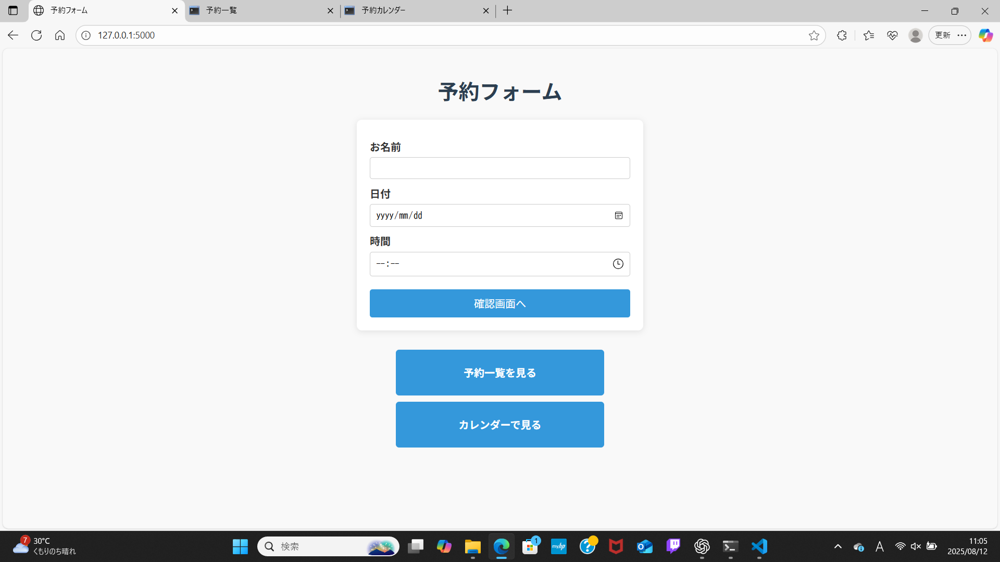
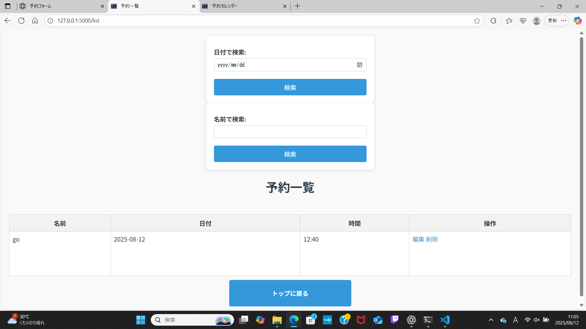

# 予約管理アプリ

## 概要
FlaskとSQLiteを使用したシンプルな予約管理アプリです。  
予約の作成・一覧表示・編集・削除・カレンダー表示が可能です。

---

## 機能一覧
- 予約作成フォーム
- 予約内容確認ページ
- 完了ページ
- 予約一覧表示（名前・日付・時間）
- 予約編集機能
- 予約削除機能
- カレンダー表示（予約付きの日を表示）

---

## 必要環境
- Python 3.10以上（推奨）
- Flask
- SQLite3（Pythonに標準搭載）

---

## インストール方法
1. このリポジトリをダウンロードまたはクローンします。
2. 必要なライブラリをインストールします。
    ```bash
    pip install flask
    ```
3. データベースを初期化します（初回のみ）。
    ```bash
    python init_db.py
    ```
4. アプリを起動します。
    ```bash
    python app.py
    ```
5. ブラウザで以下にアクセスします。
    ```
    http://127.0.0.1:5000
    ```

---

## ディレクトリ構造
project/
├── app.py # Flaskアプリのエントリポイント
├── db.py # DB接続や操作用関数
├── main_routes.py # メイン機能のルーティング
├── calendar_routes.py # カレンダー機能のルーティング
├── init_db.py # DB初期化スクリプト
├── templates/ # HTMLテンプレート
│ ├── index.html
│ ├── confirm.html
│ ├── complete.html
│ ├── list.html
│ ├── edit.html
│ └── calendar.html
└── static/ # CSSや画像
└── style.css


---

## データベース仕様
**テーブル名:** `reservations`

| カラム名 | 型      | 説明       |
|----------|--------|------------|
| id       | INTEGER | 主キー     |
| name     | TEXT    | 予約者名   |
| date     | TEXT    | 予約日     |
| time     | TEXT    | 予約時間   |

---

## 使用例
1. トップページから予約フォームに入力
2. 内容を確認して登録
3. 一覧ページまたはカレンダーで予約を確認
4. 必要に応じて編集・削除

---

## スクリーンショット（任意）
トップページ  


予約一覧ページ  

